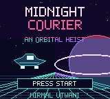
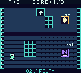
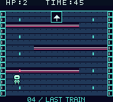
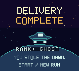

# Midnight Courier

**Steal three reactor cores. Bring back the dawn.**

A complete, compact Game Boy Color heist by Nirmal Utwani, created with Codex and the ModRetro Chromatic plugin. Four handcrafted sectors, mint circuitry, pink security beams, a three-part cipher, and one last shuttle out.

   

## Play

Download **[midnight-courier.gbc](dist/midnight-courier.gbc)** or get it from the [collection releases](https://github.com/nirmal91/chromatic-modretro-games/releases). It is a real 128 KiB **Game Boy Color-only** ROM, tested in PyBoy 2.7.0. It was successfully written to a DevDay Chromatic demo cartridge on October 7, 2026; the owner later reported playing it. Use a GBC-compatible emulator or compatible homebrew hardware.

| Action | Game Boy | Browser preview |
|---|---|---|
| Move | D-pad | Arrow keys |
| Advance/close dialogue | A | Z |
| Mission status / hint | B | X |
| Begin / replay from ending | Start | Enter |

Step onto a core, console, or lift to use it. The courier occupies two tiles, so leave clearance around crates and beams. You have three shields. Pink beams hurt; dim blue beams in the Relay are safe after its console is used.

1. **Freight** — retrieve the gold core and look for the optional purple flight log.
2. **Relay** — reach the bottom-right console, shut down the grid, and take the second core.
3. **Archive** — enter the passphrase by stepping on three terminals. A wrong entry resets the cipher and costs a shield.
4. **Last Train** — weave around the security beams and reach the north shuttle before the 45-second timer expires.

The ending ranks a perfect run with the secret log as **Ghost**, an undamaged run without it as **Ace**, and other successful deliveries as **Survivor**. Start at either ending returns to a fresh title screen.

There are synthesized pickup/error cues, but no music soundtrack. A run is intentionally short; the challenge is earning Ghost rank.

## Edit and build

Open `project.gbsproj` with **GB Studio 4.3.2**. Scenes, collisions, dialogue, variables, triggers, and conditional logic are genuine editable GB Studio resources in `project/`. Native PNG artwork is in `assets/`.

In Codex with the ModRetro Chromatic plugin:

1. Select the absolute path to this `project.gbsproj` with `project_select`.
2. Run `rom_build` with `outputPath: "build/midnight-courier.gbc"` and `captureDebugArtifacts: true`.
3. Inspect that returned ROM using `rom_inspect`. Use `web_preview` for the official browser export.
4. Run `python tools/package_build.py` to package that exact ROM and its matching symbols.
5. Run the regression suite below before committing the new `dist/`.

GB Studio's normal **Export ROM** command also creates a playable cartridge. The test suite additionally needs matching compiler symbols; the plugin's debug build supplies them.

The title, decks, terminal art, planets, and shuttle are deterministically drawn at native 160×144 resolution by `tools/draw_art.py` (Pillow). Running it regenerates those PNGs. Color palette assignments live in the corresponding native background resources.

## Automated playtests

Use Python 3.13, preferably in a virtual environment:

```sh
python -m pip install -r tests/requirements.txt
python tests/playtest.py
```

The suite boots the **shipping ROM**, delivers ordinary button presses, and reads the game's compiled variables through matching debug symbols. It never writes RAM or skips progression. Saves stay in disposable temporary directories.

Six scenarios cover:

- Full delivery, the secret log, a wrong cipher entry, and replay reset.
- A perfect Ghost run and the stopped victory timer.
- Timeout, failure screen, and retry.
- Shield exhaustion.
- The still-live Relay grid and its damage behavior.
- A lift refusing entry without its required core, including visible dialogue.

Seventeen checkpoints and framebuffer captures are saved to `test-results/`. ROM, symbol, and source hashes are checked before playback, so editing source without rebuilding fails explicitly. `docs/playtest-workflow.yml` is an inactive GitHub Actions template. To enable hosted CI, a GitHub login with the `workflow` permission must place it at `.github/workflows/playtest.yml`. The current upload credential lacks that scope, so hosted CI is not enabled. This workflow would test the committed cartridge; it would **not** rebuild the GB Studio project.

`dist/manifest.json` identifies the tested cartridge and sources. `docs/playtest-results.json` records the release verification. A browser export is built separately and can have a different ROM hash.

## Credits and licensing

Original game, backgrounds, dialogue, and test harness: Nirmal Utwani, with Codex assistance. The courier sprite, font, and UI frame originate in the ModRetro Chromatic starter. The cartridge includes GBVM and GBDK runtime components. See [THIRD_PARTY_NOTICES.md](THIRD_PARTY_NOTICES.md) and `licenses/` for the retained notices. No commercial game assets or boot ROMs are included.
